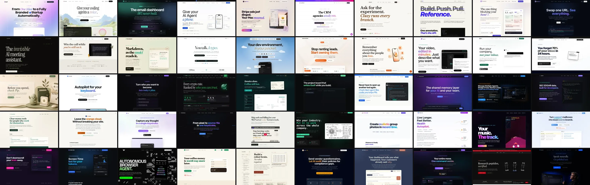

# Slopmark: landing-page hero-pattern scan

A reproducible, imperfect detector for the **slopmark**, a recurring landing-page composition:

> A short proposition in enormous type, terminated by a hard period, with one word or clause switched to italics, an accent color, a display face, or gradient text.

This repository gathers product launches, renders their landing pages in Chromium, reads their computed hero styles, and ranks likely matches. It detects a visual dialect—not AI authorship: a page can bear the slopmark without proving who or what made it.

The first two corpora are Show HN submissions from the public Algolia API and Uneed's public daily launch ladder.


The 2904×2436 WebP above is checked in at [`assets/showhn-hero-pattern-gallery.webp`](assets/showhn-hero-pattern-gallery.webp), sized at a compact 1.19:1 aspect ratio for README embeds, messaging, and social posts. It includes [Clawback](https://clawback.md/), an exact accent-word example: “Stop paying for tokens twice.”

## Quick start

Requirements: Node.js 20 or newer.

```sh
npm install
npx playwright install chromium
npm run scan -- \
  --start 2026-07-07 \
  --end 2026-07-15 \
  --output results/2026-07-07--2026-07-14.json
```

For a second launch corpus with the same renderer and scoring rules:

```sh
npm run scan:uneed -- \
  --start 2026-07-07 \
  --end 2026-07-15 \
  --output results/uneed-2026-07-07--2026-07-14.json
```

Uneed dates follow the dates accepted by its daily ladder endpoint; `--end` remains exclusive.

Show HN dates are UTC and `--end` is exclusive. The example therefore covers July 7 through July 14.

With `--limit`, pages are selected newest first. Reports retain the full unique-page count, separately report `inspectedLandingPages`, and record whether selection was limited. A limited run is a candidate-finding sample, not a prevalence estimate for the entire date range.

For a quick smoke test:

```sh
npm run scan -- --start 2026-07-14 --end 2026-07-15 --limit 10
```

To inspect exact hero markup and computed styles for specific pages:

```sh
npm run inspect -- https://openclaw.ai https://souva.app
```

## Archival screenshot gallery

`gallery/manifest.json` is the source of truth for the twelve-tile share gallery above, including viewport, compression, order, and collage layout. Regenerate every homepage crop and the final montage with:

```sh
npm run gallery
```

Recompose the montage from the checked-in screenshots without touching the network:

```sh
npm run gallery:compose
```

The pipeline saves compressed 1440×900 WebP captures under `assets/screenshots/` and a borderless 3×4 montage at `assets/showhn-hero-pattern-gallery.webp`. The individual captures are deliberately versioned because live landing pages mutate or disappear.

The independently sourced [Uneed gallery](assets/uneed-hero-pattern-gallery.webp) has parallel commands:

```sh
npm run gallery:uneed
npm run gallery:uneed:compose
```

The 50-tile scan-derived evidence wall remains separate from the curated gallery. Every wall entry is a unique, non-seed host that matched the strict signature and scored 12 or higher. Regenerate it with:

```sh
npm run gallery:slopmark
```

Recompose it from the checked-in screenshots without touching the network:

```sh
npm run gallery:slopmark:compose
```

The Uneed manifest uses `assets/uneed-screenshots/` and `assets/uneed-hero-pattern-gallery.webp`, so regenerating one corpus does not overwrite the other.

## Detection rules

The scanner finds the largest visible `h1` in the first viewport and records:

- computed font size, family, weight, line height, tracking, and color;
- terminal punctuation;
- descendant `span`, `em`, `i`, `strong`, and `b` elements;
- italic, color, font-family, and gradient differences between descendants and the H1;
- a possible short eyebrow immediately above the hero;
- a few framework hints.

The default thresholds are deliberately legible in `src/scan.mjs`:

- **large:** at least 52px;
- **sentence-like:** 18–220 characters and containing whitespace;
- **period:** visible hero text ends in `.`;
- **special phrase:** a descendant changes italics, color, family, or uses clipped gradient text.

`strict_signature` means all four conditions matched. `score12Plus` is a separate ranking, not a subset of the strict signature. It also rewards very large type, mixed faces, italics, gradients, and eyebrow copy.

## July 7–14, 2026 snapshot

The initial run found:

| Stage | Count |
|---|---:|
| Show HN submissions | 1,178 |
| External landing-page submissions | 684 |
| Unique landing pages | 663 |
| Successfully rendered with a visible H1 | 543 |
| Large sentence-style H1 | 245 |
| Large sentence ending in a period | 155 |
| Large sentence with a specially styled phrase | 136 |
| Strict signature | 98 |
| Score 12 or higher | 39 |

The broad signature appeared on 18.0% of successfully rendered pages; the score threshold captured 7.2%.

See `results/` for the machine-readable dated run. `examples/seed-urls.json` contains the pages that motivated the investigation and is not used as training data by the detector.

## Independent Uneed snapshot

Running the same detector against Uneed's public daily launch ladder for July 7–14 produced:

| Stage | Count |
|---|---:|
| Uneed launch listings | 226 |
| Unique landing pages | 226 |
| Successfully rendered with a visible H1 | 203 |
| Large sentence-style H1 | 121 |
| Large sentence ending in a period | 67 |
| Strict signature | 46 |
| Score 12 or higher | 21 |

The broad signature appeared on 22.7% of successfully rendered pages; the score threshold captured 10.3%. `gallery/uneed-manifest.json` records the twelve visually reviewed examples selected for the second gallery.

Only six of the 226 Uneed hosts also appeared in the same-dated Show HN corpus, and none of the twelve gallery selections overlapped. This makes the second gallery a mostly independent replication rather than a repackaging of the first scan.

## Slopmark evidence wall



The evidence wall contains 50 unique hosts: 33 discovered through Show HN and 17 through Uneed. All satisfy the strict signature, all score 12 or higher, and all URLs from `examples/seed-urls.json` are excluded. The wall is therefore a dense view of detector results beyond the examples that motivated the investigation, not a mood board assembled from the seed set.

## September 11, 2026 follow-up

A bounded follow-up fetched Show HN submissions for September 4–10 and rendered the **100 newest unique eligible URLs**. These selected submissions all date to September 10. It is a candidate search, not a random sample or a comparable weekly prevalence study.

| Stage | Count |
|---|---:|
| Show HN submissions in the requested week | 853 |
| External landing-page submissions | 526 |
| Unique landing pages in the requested week | 518 |
| Selected pages inspected | 100 |
| Rendered with a visible H1 | 77 |
| No visible H1 | 23 |
| Navigation errors | 0 |
| Strict signature | 12 |
| Score 12 or higher | 0 |

The [dated report](results/showhn-2026-09-04--2026-09-10-limited.json) preserves every observation, selection order, and rendering settings. The [September gallery manifest](gallery/september-manifest.json) identifies seven scan candidates and the separately nominated [Herdr](https://herdr.dev/) example. Herdr is not included in these scan counts. Talleyrand is an adjacent example without a terminal period.

```sh
npm run scan -- --start 2026-09-04 --end 2026-09-11 --limit 100 --concurrency 4 --output results/showhn-2026-09-04--2026-09-10-limited.json
node src/gallery.mjs --manifest gallery/september-manifest.json
```

The original July reports and screenshot directories are preserved. The September pass uses the same style thresholds as July; the scanner changes only clarify limiting, record rendering settings, validate numeric arguments, and select bounded samples newest first.

## Caveats

- Pages change. A rerun measures the current landing page, not necessarily what appeared on launch day.
- Client-side rendering, bot protection, consent screens, A/B tests, and network failures create missing or misleading observations.
- GitHub, app-store, document, social, and similar links are excluded because they are not product landing pages.
- The fast scanner blocks images, media, and fonts and waits only 500 ms after DOM load. Custom fonts and late animations can change the actual visual result. The current detector also ignores styled fragments narrower than 100 px or shorter than 20 px, and does not score font-weight changes alone; it can miss the short bold or italic word that motivated this search. Use full-resource screenshots for visual review.
- Color changes can be semantic for reasons unrelated to this pattern; rankings require visual review.
- The framework hints are diagnostics, not evidence. Astro, Next.js, Webflow, Framer, and plain HTML can all produce the same composition.
- Most importantly: visual convergence cannot establish whether a human, an agent, a template, or some mixture produced a page.
