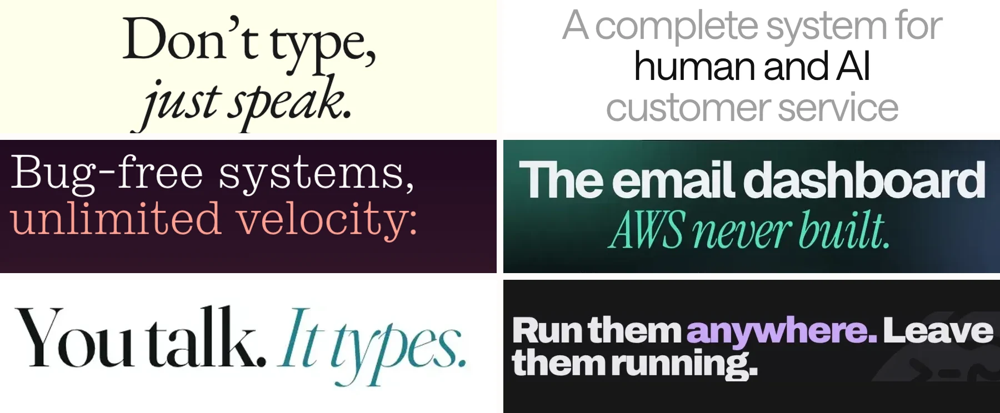
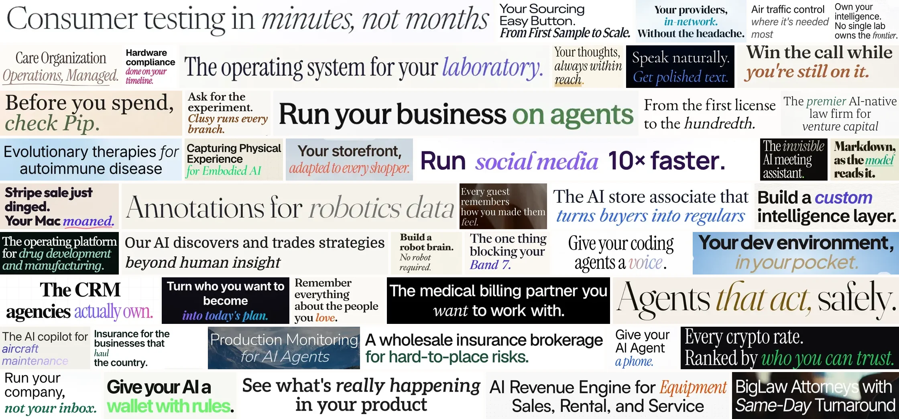

# Slopmark

A collection of oversized landing-page headlines with a word or phrase set apart in italics, another typeface, or an accent color.

Adrian Krebs’s April 20, 2026 [post](https://www.adriankrebs.ch/blog/design-slop) identifies the italic accent-word pattern, and his [Design Slop Cop](https://github.com/AdrianKrebs/design-slop-cop) scans for a broader set of design tells. I built this gallery and scanner independently in July, before I knew his work. I discovered it in September and picked this project back up because of it. I’m glad people are noticing.





The galleries use preserved screenshots, with source URLs and crop coordinates in their [lead](gallery/lead-contact-sheet.json) and [dense gallery](gallery/dense-contact-sheet.json) manifests.

The scanner finds candidates through deterministic typography checks. The final galleries are visually selected. A matching design does not establish AI authorship.

## Use it

Node.js 20 or newer:

```sh
npm install
npx playwright install chromium
npm run inspect -- https://example.com
npm test
```

The collection draws from Show HN, Uneed, YC company directories, and individually reviewed sites. Captures stay in [assets/](assets/); dated observations and review labels stay in [results/](results/).

- [Reproduce a gallery or run a scan](docs/reproduce.md)
- [How detection works—and where it fails](docs/methodology.md)
- [Detailed scan history and archived galleries](docs/research-notes.md)
